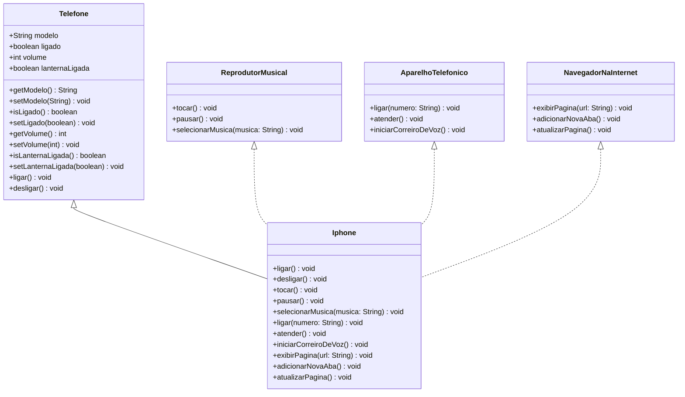

### Diagrama UML (Mermaid)

```mermaid
classDiagram
    class Telefone {
        +String modelo
        +boolean ligado
        +int volume
        +boolean lanternaLigada
        +getModelo() String
        +setModelo(String) void
        +isLigado() boolean
        +setLigado(boolean) void
        +getVolume() int
        +setVolume(int) void
        +isLanternaLigada() boolean
        +setLanternaLigada(boolean) void
        +ligar() void
        +desligar() void
    }

    class ReprodutorMusical {
        +tocar() void
        +pausar() void
        +selecionarMusica(musica: String) void
    }

    class AparelhoTelefonico {
        +ligar(numero: String) void
        +atender() void
        +iniciarCorreiroDeVoz() void
    }

    class NavegadorNaInternet {
        +exibirPagina(url: String) void
        +adicionarNovaAba() void
        +atualizarPagina() void
    }

    class Iphone {
        +ligar() void
        +desligar() void
        +tocar() void
        +pausar() void
        +selecionarMusica(musica: String) void
        +ligar(numero: String) void
        +atender() void
        +iniciarCorreiroDeVoz() void
        +exibirPagina(url: String) void
        +adicionarNovaAba() void
        +atualizarPagina() void
    }

    Telefone <|-- Iphone
    ReprodutorMusical <|.. Iphone
    AparelhoTelefonico <|.. Iphone
    NavegadorNaInternet <|.. Iphone
    
```